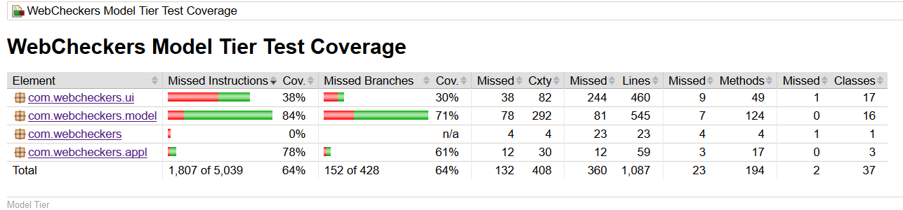

# PROJECT Design Documentation

## Team Information
* Team name: team-project-2181-swen-251-02-d
* Team members
  * William Johnson
  * Sean Dunn
  * Gabriel Jusino
  * Brunon Sztuba
  * Che Young

## Executive Summary

This project entails the usage of Java, Spark, and FreeMarker to create a website
which allows users to log in and select an opponent from a list of current users
with whom to play a game of checkers. 

### Purpose

The purpose of the project is to create the functionality of a checkers
board game which requires signing in before you have access to the game.
The most important user group would be checkers players and their goal is
to play the checkers game with the proper rules.

### Glossary and Acronyms

| Term | Definition |
|------|------------|
| VO | Value Object |
| MVP | Minimum Viable Product|

## Requirements

This section describes the features of the application.

### Definition of MVP
    The MVP is the Minimum Viable Product or the base functionality that
    the project should have to satisfy the customer. In this project, the MVP
    is the creation of a Java-based web app that allows users to join a website's
    pool of users, select an opponent, and play a standard game of chess with them.
    Within that game, they will each have their own display with their pieces at the bottom,
    and take turns making a move. Players will be able to resign, as well as sign out.

### MVP Features
The Epics and Stories for the MVP:
    Epic: Game Play
    -Forfeit Game
    -Player Regular Movement
    -Player King Movement
    -King Achievment
    -Player Simple Jump
    -Player Multiple Jump
    -Turn Mechanics
    -Start a Game

### Roadmap of Enhancements
The enhancements that we plan on implementing are:
   Epic: Computer
   -Computer Regular Movement
   -Computer Single Jump
   -Computer Multiple Jump
   -Computer Difficulty
   Epic: Replay
   -Save Games
   -Replay Saved Games

## Application Domain

This section describes the application domain.

The domain model specifies the major entities that will interact with each other within
the final product. Primarily, this includes the view, the server, and the game. The view
includes the UI elements that will be displayed on the user's machine, with which they
will interact. These interactions will send information to the server, which keeps track of
users, games, and other useful information. The website then commands the game to perform
the required simulations to model the action the user gave. The game keeps track of the
business logic behind players and the board, which keeps track of rows. Rows hold spaces,
which hold pieces. The view represents the UI tier, the server the Controller tier, and the
game the Model tier.

## Architecture and Design

The architecture used for this project will be a simple UI-Application-Model tiered design.
The server client UI provides an interactive connection to the server UI, which handles HTTP
requests to generate appropriate views. The application tier provides logical control
for the flow of the entire system. The model tier holds the business logic, in which
the information modelling for the game will take place. Embedded within the
server UI is the controller, which receives user input, commands the model to
perform the necessary simulations, then updates its view templates appropriately.
Thus, the architecture is an adapted form of the traditional model-view-controller
design, optimized for web usage.

The design of the model package has several examples of adherence to good design principles.
Firstly, the Rules class is an example of `pure fabrication. Within the domain analysis,
the idea of rule adherence and validation of moves was distributed amongst the different
components. Implementing this would have both increased coupling, by forcing each class
to work with others to figure out if a certain event was allowed, and reduced cohesion/
violated the single-responsibility principle, by forcing the class to both simulate
and event and determine its validity. Therefore, a separate class, Rules, was created for this,
and its existence allows the other classes to have lower coupling and high cohesion.
Another good design principle that can be seen in our model package is information master.
The BoardView is the class that has all the business data of the board, and, as such, is the class
that directly does the work on it. The Move classes, for example, do not directly modify or work
with the data in the BoardView. Rather, they call on methods within the BoardView, and the
BoardView handles the logic simulation internally. This also has the effect of reducing coupling;
since the Move subclasses simply call methods in their superclass, which calls methods in BoardView,
the Move classes are only coupled to one class, despite being able to do a significant amount of work.
The Move classes also obey the Liskov substitution principle and the open/closed principle;
substituting any of the Move subclasses in for the superclass would not affect
program functionality, as they simply expand on the behavior of their superclass rather than
modifying it. This also means that open/closed is followed, as the Move superclass could easily
be extended by several new Move classes (expanded), but it would not require modification to do
so. This scalability is indicative of good design and good usage of polymorphism.

### Summary

The following Tiers/Layers model shows a high-level view of the webapp's architecture.

As a web application, the user interacts with the system using a
browser.  The client-side of the UI is composed of HTML pages with
some minimal CSS for styling the page.  There is also some JavaScript
that has been provided to the team by the architect.

The server-side tiers include the UI Tier that is composed of UI Controllers and Views.
Controllers are built using the Spark framework and View are built using the FreeMarker framework.  The Application and Model tiers are built using plain-old Java objects (POJOs).

Details of the components within these tiers are supplied below.

### Overview of User Interface

This section describes the web interface flow; this is how the user views and interacts
with the WebCheckers application.

The user will have the ability to view 4 different pages. Upon connecting to the website,
they will go to a sign in page. From here, they can sign in or go to home.
If they go to home first, they are just told how many players are currently signed in.
From the sign in page, upon entering their information, the player posts a GET route
to the server, which responds by setting their page to the homepage of the game. From here,
they can select a player to play with, or log out. If they select a player to play with,
the server receives a GET route, and takes them to the game page. If they are selected
to play a game, the server executes a POST route which takes them to a game. If they sign out,
the server gets a GET route which takes them to a sign out page, from which they can GET to the
home page. If a user is in a game, when they move a piece, the POST route for validate move
is called ensuring that the move is valid. The user then has the choice between submitting their
turn or backup their previous move and make a new move. A user submitting their turn switches the
turn for the board. A user can resign from a game during their turn which will redirect both the
current user and other user to the home page. If the enhancements are completed, there will also
be a replay page that the user can access from home that allows them to replay old games and a
user can play a checkers game against the computer.

### UI Tier

The UI tier begins with the web server being initialized in the WebServer class which
initializes the get and post methods that will be utilized throughout the checkers game.
The SessionTimeoutWatchdog class was defined to terminate idle sessions on the server.
The first method called by the server is the get for the home_URL (/). The critical
attributes for the get for the home_URL is the UserName for the current user. If the
UserName is null then when a link is available for the current user to click which
will redirect the sever to the get for the signIn_URL (/signIn).

The current user attempts to assign themselves a username. The server calls the post for the
signIn_URL to determines whether the username is valid in which the server is redirected to
the get for the home_URL or the username is invalid then the server remains at the get for
the signIn_URL. If the server was redirected to the get for the home_URL, the userName
attribute is saved as the current user's new username.

With the userName attribute defined for the get for home_URL, the current user has the option to
play a game with another user already signed into the game. The current user can click on the other
user and the server will be redirected to the get for the game_URL (/game). The critical attributes
for the get for the game_URL is board which is the game board view, viewMode which describes the view
for the player, redPlayer which is the red player in the checkers game, whitePlayer which is the white
player in the checkers game, currentPlayer which is the current user for the localhost, activeColor which
describes whose turn it is in the Checkers game, and modeOptions and Json the descibes the mode options
that the current user wants to utilize. These attributes are defined in the post for the home_URL before
the server was directed to the get for the game_URL.

The server will call the post for the checkTun_URL to determine whether the current user has finished
their turn. The server will call the post for the validateMove_URL (/validateMove) when the current user
attempts to move a piece.  After the current user attempts to move a piece, the current is allowed to make
two options: call server for the post for the backupMove_URL (/backupMove) or call server for the post for
the submitTurn_URL (/submitTurn). The post for the backupMove_URL undos the current user's last move and
then redirects the current user to the game_URL where they would need to attempt a new move. The post for
the submitTurn_URL changes the value for active color to indicate that it is now the other user's turn. The
current user also has the option in their turn to call server for the post for the resignGame_URL (/resignGame).
The post for resign game changes the inGame status for the current player and should redirect both users to
the get for the home_URL

### Application Tier

The application tier begins with a GameCenter class which is utilized by all user.
The GameCenter is utilized to display data and information that is utilized for every
user. To add a user to the universal GameCenter each user is given their own individual
PlayerServices class. The PlayerService class has the functionality signing the user into
the game as well as storing their username into the PlayerLobby. The PlayerLobby class is
a class whose sole responsibility is to provide access to the users signed in to play the
game.

### Model Tier

The model tier begins with the BoardView class whose main attribute is an array of 8 Row objects. Each Row Object
has 8 instances of Space objects. Each Space has a color value and a Piece object. Each Piece is defined by its
color and Position object. Each Position object is defined by an x and y coordinate value. The piece movement in the
BoardView is handled by classes that extend the abstract Move class. The classes that extend the abstract Move class
are MoveAttempt, which attempts movement and determines what type of movement it is, MoveStandard, which simply moves
the piece to the appropriate space, and MoveJump, which moves the piece to the appropriate spot while removing the
correct opponent piece. A rules class was utilized to implement the proper logic for the move classes. The message class
is utilized to display information and error messages in the model

### Design Improvements

Design improvements that we would make to the project would be a functioning
post validate move and post submit turn. Post validate move doesn't properly
put piece on the board and doesn't properly update the BoardView. Post submit
turn accidentally rewrites the first user's board so that it resembles the second
person's board. The post routes also fail to reload the board upon completion

## Testing
Testing for this sprint entailed the writing of JUnit tests for each class, with the goal of covering
as high a percentage of the code as possible and validating the correctness of the methods within the
classes being tested.

### Acceptance Testing

We did acceptance testing for 4 user stories and 17 acceptance criteria
tasks. We only passed 4 acceptance criteria tasks and failed the 4 user
stories and the other 13 criteria tasks. The main issue that we have is
with the functionality of our Move class.

### Unit Testing and Code Coverage

Application-tier testing:
Our unit testing strategy for the tier was to test the functionality of adding users to the structures. This is
the main functionality of the application tier right now. The total coverage for this tier is 79%. In the future
and with more time we can increase the coverage for this tier because the functionality for this tier is the
easiest to test

Model-tier testing:
Our unit testing strategy consisted of trying to get the maximum code coverage possible of the foundational classes
first, so that instances of these could be used for testing the larger classes, such as BoardView and
Rules, which, by design, cannot be tested with mocks of the objects on which they do work. Tests for the building blocks
of model, Player, Space, Piece, and Row each had 90%+ coverage, most of them reaching 100%. The only missing parts
for these tests were the  constructors for the iterators, but the iterators themselves were tested, so this is not an
issue. Following the verification that each of the building blocks worked properly, BoardView and Rules could be tested.
Testing these classes was a much more involved task. BoardView() has 92% of its instructions covered, although
only 83% of its branches. This is due to the fact that, although the tests were quite thorough, they only
apply to a BoardView made for a red player. Admittedly, a more complete test suite would check both, and
in the future this may be added. However, visual inspection of the code shows that it would function properly for a
white player as well, and it works properly when the game is launched, so it is not a big deal. Rules, as probably the
most complicated class due to the nature of the game, is not tested as well as we would like. We were shooting for 90%
coverage in everything, however, the amount of work required to hit all of the conditional statements in the canJump()
method was not worth the effort, as it would require totally moving the board around to set up movement in the 0th and
7th row. However, these branches pass visual inspection, and they have the same underlying logic as the
parts that were tested, so we were not overly concerned. Furthermore, Rules has a private method setForceJump that
is not testable due to its privacy restriction, negatively impacting the percentage covered. However, two king jumps,
one on the rightmost column and moving backwards-left and one up-right jump were tested, along with a standard
jump and a standard move. All of these passed perfectly, indicating that the uncovered code, which is logically
identical, simply with different values for testing other edge cases, would function correctly. Nevertheless,
additional testing of the Rules class would not be a bad idea, particularly of the private method.

UI - testing:
Our approach to creating testing was testing the values when playerservices is null and checking to see when redirect
occurred. We also checked to see if attributes were properly defined in certain conditions and that the returned value
is the appropriate message type, if a message object is returned. Creating the test for this tier was difficult because
of our lack of knowledge with mocks. Eventually we were able to create base cases which tested the functionality for
these conditions. Not all conditions were properly tested because of a lack of time.